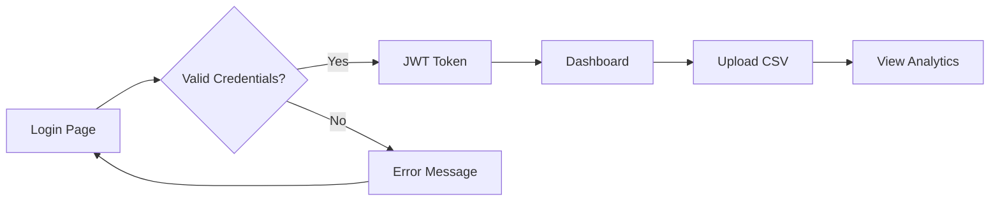

<div align="center">

# 🏭 ChemEquip Analytics Pro

### Industrial Parameter Analytics & Visualization Platform

[](https://reactjs.org/)
[](https://www.typescriptlang.org/)
[](https://vitejs.dev/)
[](https://tailwindcss.com/)
[](https://vercel.com/)

[Live Demo](https://chemequi.vercel.app) · [Report Bug](https://github.com/issues) · [Request Feature](https://github.com/issues)

</div>

## ✨ Features

<table>
<tr>
<td width="50%">

### 📊 Analytics Dashboard
- Real-time statistics cards
- Parameter cards with detailed metrics
- Interactive data tables
- Animated number transitions

</td>
<td width="50%">

### 📈 Advanced Visualizations
- Donut/Pie charts for distributions
- Grouped bar charts for comparisons
- Histograms for numerical analysis
- Multi-line trend comparisons

</td>
</tr>
<tr>
<td width="50%">

### 🔐 Secure Authentication
- JWT-based login system
- Email/password signup
- Password reset via email
- Rate limiting protection

</td>
<td width="50%">

### 🎨 Modern UI/UX
- Dark & Light theme toggle
- Smooth animations & transitions
- Responsive design (mobile-first)
- Glass-morphism effects

</td>
</tr>
</table>

## 🚀 Quick Start

### Prerequisites

- **Node.js** 18.0 or higher
- **npm** or **yarn**

### Installation

```bash
# Clone the repository
git clone https://github.com/yourusername/chemequip-web.git

# Navigate to frontend directory
cd chemequip-web/frontend

# Install dependencies
npm install

# Start development server
npm run dev
```

The app will be available at `http://localhost:5173`

## 🛠️ Tech Stack

<div align="center">

| Category | Technologies |
|----------|-------------|
| **Framework** |  |
| **Language** |  |
| **Build Tool** |  |
| **Styling** |  |
| **Charts** |   |
| **Icons** |  |
| **Deployment** |  |
| **Backend** |   |

</div>

## 📁 Project Structure

```
frontend/
├── 📄 index.html              # HTML entry point
├── 📄 index.tsx               # React entry point
├── 📄 App.tsx                 # Main application component (1400+ lines)
├── 📄 types.ts                # TypeScript type definitions
├── 📄 constants.tsx           # Theme colors & constants
├── 📄 vite.config.ts          # Vite configuration
├── 📄 tsconfig.json           # TypeScript configuration
├── 📄 package.json            # Dependencies & scripts
│
├── 📂 components/
│   ├── Button.tsx             # Reusable button component
│   ├── Card.tsx               # Card container component
│   ├── Charts.tsx             # All chart components (Line, Bar, Donut, Histogram)
│   ├── DashboardHeader.tsx    # Header with notifications & user menu
│   ├── Progress.tsx           # Progress bar component
│   ├── Sidebar.tsx            # Navigation sidebar
│   └── StatsCard.tsx          # Statistics card component
│
├── 📂 services/
│   └── api.ts                 # API service (auth, upload, analytics)
│
└── 📂 public/
    └── assets                 # Static assets
```

## 🎯 Core Features

### 📊 Dashboard Tabs

<details>
<summary><b>Analytics Tab</b></summary>

- **Stats Cards**: Total records, columns, numeric/categorical counts
- **Parameter Cards**: Individual metrics with mean, median, std, min, max
- **Data Overview**: Tabular view of all statistics
- **Animated Numbers**: Smooth count-up animations

</details>

<details>
<summary><b>Visualizations Tab</b></summary>

- **Donut Charts**: Status distribution with percentages
- **Grouped Bar Charts**: Multi-category comparisons
- **Histograms**: Numerical distribution with bin analysis
- **Bar Charts**: Categorical value frequencies

</details>

<details>
<summary><b>Trends Tab</b></summary>

- **Live Parameter Trends**: Individual line charts per metric
- **Parameter Comparison**: Combined multi-line overlay chart
- **Statistical Trends**: Mean, Median, Std Dev comparisons

</details>

### 🔐 Authentication Flow



### 📤 CSV Upload

1. Click **Upload CSV** button
2. Select or drag-and-drop your CSV file
3. Automatic validation & processing
4. Instant analytics generation
5. View in dashboard tabs

## 🎨 Theme System

<div align="center">

| | Dark Theme | Light Theme |
|---|---|---|
| **Background** | `#0B0B0C` | `#F0F2F1` |
| **Surface** | `#141416` | `#FFFFFF` |
| **Primary** | `#E6F76A` | `#E6F76A` |
| **Secondary** | `#A7E8C3` | `#A7E8C3` |
| **Text** | `#FFFFFF` | `#141416` |
| **Muted** | `#9CA3AF` | `#6B7280` |

</div>

Toggle between themes using the **Sun/Moon** icon in the header.

## 🔧 Configuration

### Environment Variables

Create a `.env.local` file:

```env
# Optional: Gemini API key for AI features
GEMINI_API_KEY=your_api_key_here
```

### API Configuration

The frontend connects to the Django backend:

```typescript
// services/api.ts
const API_BASE_URL = 'https://web-production-7bcce.up.railway.app';
```

## 📱 Responsive Design

The application is fully responsive:

| Breakpoint | Description |
|------------|-------------|
| `< 640px` | Mobile layout, stacked components |
| `640px - 1024px` | Tablet layout, 2-column grids |
| `> 1024px` | Desktop layout, full sidebar |

## 🚀 Deployment

### Vercel (Recommended)

```bash
# Install Vercel CLI
npm i -g vercel

# Deploy
vercel --prod
```

### Manual Build

```bash
# Build for production
npm run build

# Preview production build
npm run preview
```

## 📦 Available Scripts

| Command | Description |
|---------|-------------|
| `npm run dev` | Start development server |
| `npm run build` | Build for production |
| `npm run preview` | Preview production build |

## 🔗 Related Projects

| Project | Description | Link |
|---------|-------------|------|
| **Backend API** | Django REST Framework | [/backend](../backend) |
| **Desktop App** | PyQt5 + Matplotlib | [/desktop](../desktop) |

## 🤝 Contributing

Contributions are welcome! Please follow these steps:

1. **Fork** the repository
2. **Create** a feature branch (`git checkout -b feature/AmazingFeature`)
3. **Commit** your changes (`git commit -m 'Add AmazingFeature'`)
4. **Push** to the branch (`git push origin feature/AmazingFeature`)
5. **Open** a Pull Request

## 📄 License

This project is licensed under the **MIT License** - see the [LICENSE](../LICENSE) file for details.

## 👏 Acknowledgments

- [Recharts](https://recharts.org/) for beautiful charts
- [Lucide](https://lucide.dev/) for stunning icons
- [Tailwind CSS](https://tailwindcss.com/) for utility-first styling
- [Vercel](https://vercel.com/) for seamless deployment

---

<div align="center">

**⭐ Star this repository if you found it helpful!**

Made with ❤️ by the ChemEquip Team

[](https://github.com/)
[](https://linkedin.com/)

</div>
